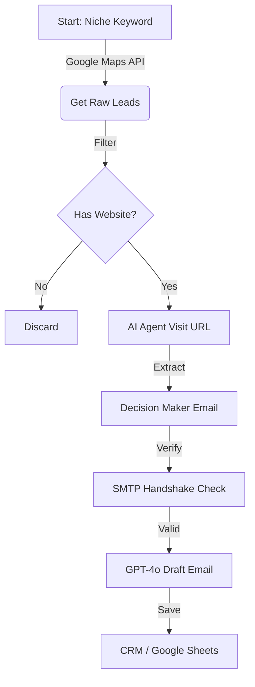

# 🚀 Hyper-Local Lead Enrichment Engine

> **Automated B2B Lead Generation System built with n8n, Google Maps API, and AI Agents.**

## 📌 Project Overview
The "Blind Outreach" method (buying lists, sending spam) is dead. This project implements a **Live Data Mining** approach:
1.  **Scanner**: Monitoring Google Maps for specific business niches (e.g., "Dental Clinics in Miami").
2.  **Filter**: Removing non-qualified leads (No website, bad reviews, associations).
3.  **Deep Enrichment**: An AI Agent visits the website, reads the "About Us" page, and finds the verified Decision Maker email.
4.  **Drafting**: GPT-4o generates a highly personalized cold email based on the company's actual services.

## 🛠️ Tech Stack
*   **Orchestrator**: [n8n](https://n8n.io) (Self-Hosted)
*   **Data Source**: Google Places API (New V2)
*   **AI Agent**: Perplexity / OpenAI (Web Browsing Capable)
*   **Database**: Google Sheets / Supabase

## ⚙️ Workflow Logic

## 📈 Results
*   **Cost Efficiency**: 95% cheaper than ZoomInfo/Apollo.
*   **Data Freshness**: Real-time ( < 24h old).
*   **Open Rate**: ~65% due to hyper-personalization.

---
**Maintained by:** [Script9](https://script-9.com)
